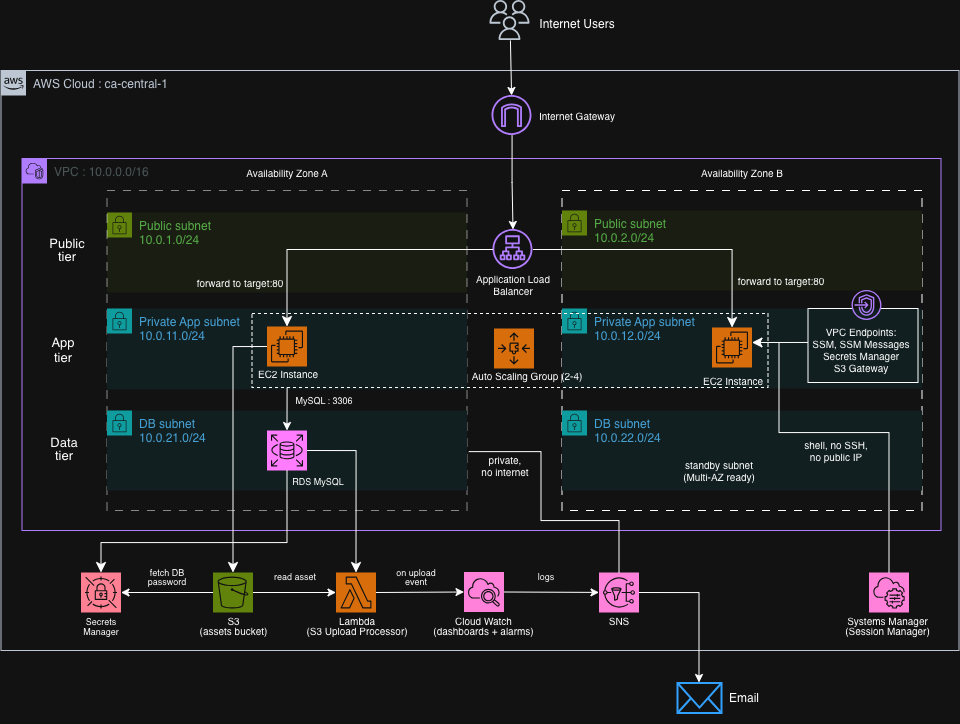

# AWS 3-Tier Web Application (Terraform)

A production-style, highly-available 3-tier web application on AWS, provisioned entirely with Terraform. The application tier runs on a self-healing Auto Scaling group behind an Application Load Balancer, backed by a private RDS MySQL database, with no public access to the compute or data tiers.



## Overview

This project provisions a complete 3-tier architecture as infrastructure-as-code. Traffic from the internet reaches an internet-facing Application Load Balancer in public subnets, which forwards requests to EC2 instances running in private subnets. Those instances read and write to an RDS MySQL database in isolated data subnets, retrieve their database credentials from AWS Secrets Manager, and read static assets from S3 - all over private networking with no internet egress from the private tiers.

Everything is defined in Terraform and can be deployed or destroyed with a single command. Terraform state is stored remotely in S3 with native state locking.

## Architecture

The environment spans two Availability Zones for high availability, divided into three tiers:

- **Public tier** : An Application Load Balancer, the only internet-facing component.
- **Application tier** : EC2 instances in private subnets, managed by an Auto Scaling group. No public IPs.
- **Data tier** : An RDS MySQL instance in dedicated private subnets, reachable only from the application tier.

**Request flow:** Internet → Internet Gateway → Application Load Balancer → EC2 (private) → RDS (private). The application also reads a static asset from S3 and fetches its database password from Secrets Manager, both via VPC endpoints.

## AWS services used

| Service | Purpose |
|---|---|
| VPC, Subnets, Route Tables, IGW | Network foundation across two AZs |
| EC2 + Auto Scaling Group | Self-healing application compute |
| Application Load Balancer | Public entry point, health checks, load distribution |
| RDS (MySQL) | Managed relational database, private |
| S3 | Static asset storage + Terraform remote state |
| Secrets Manager | RDS master credentials (no secrets in code) |
| VPC Endpoints (SSM, SSM Messages, Secrets Manager, S3 Gateway) | Private access to AWS services, no internet egress |
| Systems Manager (Session Manager) | Shell access to private instances, no SSH |
| Lambda | Event-driven processing of S3 uploads |
| CloudWatch + SNS | Dashboard, alarms, and email alerting |
| IAM | Least-privilege roles and policies |
| Terraform | Infrastructure as code |

## Design decisions

**Private application and data tiers.** Only the load balancer is exposed to the internet. EC2 instances and the database have no public IP addresses, which minimises the attack surface - the only reachable entry point is the ALB.

**SSM Session Manager instead of a bastion host.** Administrative shell access to private instances is provided through AWS Systems Manager rather than SSH. There are no SSH keys to manage or leak, no bastion host to run and secure, and no inbound ports open on the instances.

**VPC endpoints instead of a NAT Gateway.** The private tiers have no internet access at all. Instead, VPC endpoints provide private connectivity to the specific AWS services the instances need (SSM, Secrets Manager, and S3). This is more secure than routing outbound traffic through a NAT Gateway and also lower cost.

**RDS-managed master password in Secrets Manager.** The database password is generated and stored by RDS in Secrets Manager. It never appears in the Terraform code or state file. The application fetches it at runtime using its IAM role.

**Least-privilege IAM.** The instance role can read only the specific RDS secret and the specific S3 bucket it needs - scoped to exact ARNs rather than broad permissions.

**Auto Scaling with rolling instance refresh.** The application runs as an Auto Scaling group across both AZs, so a failed instance (or a failed Availability Zone) is automatically replaced. New application versions are rolled out with a rolling instance refresh that keeps at least half the fleet in service, enabling zero-downtime deployments.

**Security group chaining.** Each tier accepts traffic only from the tier in front of it, referenced by security group rather than IP range: the ALB accepts the internet, the app instances accept only the ALB, and RDS accepts only the app instances.

**Remote Terraform state.** State is stored in S3 with encryption and native locking, so the infrastructure is reproducible and safe to manage over time.

## Repository structure

```
aws-3tier-web-app/
├── terraform/
│   ├── main.tf                 # providers and S3 backend
│   ├── network.tf              # VPC
│   ├── subnets.tf              # public/app/db subnets across 2 AZs
│   ├── routing.tf              # internet gateway and public routing
│   ├── endpoints.tf            # VPC endpoints + private route table
│   ├── security-groups.tf      # app and db security groups
│   ├── database.tf             # RDS MySQL + subnet group
│   ├── app-secrets.tf          # Secrets Manager endpoint + read policy
│   ├── iam.tf                  # EC2 instance role and profile
│   ├── compute.tf              # launch template + AMI
│   ├── autoscaling.tf          # Auto Scaling group
│   ├── alb.tf                  # load balancer, target group, listener
│   ├── app-ingress.tf          # app accepts traffic only from ALB
│   ├── s3.tf                   # assets bucket
│   ├── lambda.tf               # S3-triggered function
│   ├── monitoring.tf           # CloudWatch dashboard, alarms, SNS
│   ├── variables.tf            # input variables
│   └── user-data.sh.tftpl      # instance bootstrap script
└── docs/
    └── Architecture.png
```

## Deployment

**Prerequisites**
- An AWS account and credentials
- Terraform >= 1.10
- An S3 bucket for remote state (referenced in `main.tf`)
- A `terraform.tfvars` file supplying `alert_email` (not committed)

**Deploy**
```
cd terraform
terraform init
terraform plan
terraform apply
```

Deployment takes roughly 10 minutes (RDS is the slowest resource). After apply, the load balancer's DNS name serves the application.

**Destroy**
```
terraform destroy
```

## Demo

**Application served through the load balancer**

*The application accessed via the ALB's public DNS connecting to the private RDS database, reading a static asset from S3, and reporting which instance served the request.*


**Load balancing across instances**

*The subsequent request, served by a different instance - the load balancer distributing traffic across both Availability Zones.*


**Self-healing Auto Scaling group**

*A terminated instance is automatically detected and replaced by the Auto Scaling group, restoring the fleet to full capacity with no manual intervention.*


**Event-driven Lambda**

*An S3 upload automatically triggers the Lambda function, which logs the event to CloudWatch.*


**Monitoring dashboard**

*The CloudWatch dashboard showing ALB requests and response codes, EC2 fleet CPU, and RDS load on a single view.*


**Alarm and alerting**

*CloudWatch alarm history showing the state transition and the SNS notification action being executed.*


## Possible improvements

- HTTPS on the load balancer via ACM certificate
- Multi-AZ RDS for automatic database failover
- A CI/CD pipeline to run `terraform plan` on pull requests
- Containerising the application tier onto ECS Fargate
- CloudFront in front of S3 for public static content
